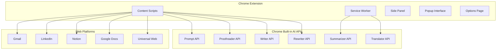

# Design Document

## Overview

IntelliPen is a Chrome extension that leverages Chrome's built-in AI APIs (Gemini Nano) to provide intelligent writing assistance and meeting transcription capabilities. The extension operates entirely client-side, ensuring complete privacy while delivering professional-grade AI functionality across all web platforms.

The system architecture follows Chrome Extension Manifest V3 standards and utilizes multiple Chrome AI APIs including the Prompt API, Proofreader API, Writer API, Rewriter API, Summarizer API, and Translator API. All processing happens locally using the Gemini Nano model, eliminating the need for external servers or user accounts.

## Architecture

### High-Level System Architecture



### Extension Architecture

The extension follows a modular architecture with clear separation of concerns:

**Service Worker (background.js)**
- Coordinates API calls and manages extension state
- Handles audio processing for meeting transcription
- Manages cross-tab synchronization
- Processes meeting analysis and summary generation

**Content Scripts**
- `grammar-overlay.js`: Provides real-time writing assistance
- `meeting-interface.js`: Manages meeting transcription UI
- `universal-integration.js`: Handles platform-specific integrations

**User Interface Components**
- Side Panel: Primary meeting interface and transcript display
- Popup: Quick access controls and status indicators
- Options Page: Advanced settings and privacy controls

## Components and Interfaces

### Writing Intelligence Engine

The writing intelligence system provides real-time grammar correction and style improvements across all web platforms.

**Core Components:**

```javascript
class WritingIntelligenceEngine {
  constructor() {
    this.proofreaderSession = null;
    this.writerSession = null;
    this.rewriterSession = null;
    this.activeElements = new Map();
  }

  async initialize() {
    // Initialize AI sessions
    this.proofreaderSession = await chrome.ai.proofreader.create();
    this.writerSession = await chrome.ai.writer.create();
    this.rewriterSession = await chrome.ai.rewriter.create();
  }

  async analyzeText(text, context) {
    const [grammarResults, styleResults] = await Promise.all([
      this.proofreaderSession.proofread(text),
      this.writerSession.analyze(text, { context })
    ]);
    
    return this.mergeResults(grammarResults, styleResults);
  }

  async improveText(text, improvements) {
    return await this.rewriterSession.rewrite(text, {
      tone: improvements.tone,
      style: improvements.style,
      corrections: improvements.corrections
    });
  }
}
```

**Text Detection and Integration:**

```javascript
class UniversalTextIntegration {
  constructor(writingEngine) {
    this.writingEngine = writingEngine;
    this.observers = new Map();
    this.platformAdapters = {
      'gmail.com': new GmailAdapter(),
      'linkedin.com': new LinkedInAdapter(),
      'notion.so': new NotionAdapter(),
      'docs.google.com': new GoogleDocsAdapter()
    };
  }

  initialize() {
    this.detectPlatform();
    this.setupTextFieldObservers();
    this.injectSuggestionOverlay();
  }

  detectPlatform() {
    const hostname = window.location.hostname;
    this.currentAdapter = this.platformAdapters[hostname] || 
                         new UniversalAdapter();
  }

  setupTextFieldObservers() {
    const textFields = this.currentAdapter.getTextFields();
    textFields.forEach(field => this.observeTextField(field));
  }
}
```

### Meeting Intelligence System

The meeting system captures, transcribes, and analyzes audio conversations using Chrome's multimodal AI capabilities.

**Audio Processing Pipeline:**

```javascript
class MeetingIntelligenceSystem {
  constructor() {
    this.promptSession = null;
    this.summarizerSession = null;
    this.isRecording = false;
    this.transcript = [];
    this.speakers = new Map();
  }

  async initialize() {
    this.promptSession = await chrome.ai.languageModel.create({
      expectedInputs: [{ type: 'audio' }]
    });
    this.summarizerSession = await chrome.ai.summarizer.create();
  }

  async startMeeting() {
    this.isRecording = true;
    const stream = await navigator.mediaDevices.getUserMedia({ 
      audio: { 
        echoCancellation: true,
        noiseSuppression: true,
        sampleRate: 16000
      } 
    });
    
    this.processAudioStream(stream);
  }

  async processAudioStream(stream) {
    const mediaRecorder = new MediaRecorder(stream);
    const audioChunks = [];

    mediaRecorder.ondataavailable = async (event) => {
      if (event.data.size > 0) {
        const audioBlob = new Blob([event.data], { type: 'audio/wav' });
        const transcription = await this.transcribeAudio(audioBlob);
        this.processTranscription(transcription);
      }
    };

    mediaRecorder.start(1000); // Process every second
  }

  async transcribeAudio(audioBlob) {
    const result = await this.promptSession.promptStreaming([
      { type: 'audio', data: audioBlob },
      { type: 'text', data: 'Transcribe this audio with speaker identification and timestamps.' }
    ]);
    
    return result;
  }
}
```

**Meeting Analysis and Output Generation:**

```javascript
class MeetingAnalyzer {
  constructor(summarizerSession, writerSession) {
    this.summarizerSession = summarizerSession;
    this.writerSession = writerSession;
  }

  async generateMeetingOutputs(transcript) {
    const [summary, actionItems, keyDecisions] = await Promise.all([
      this.generateSummary(transcript),
      this.extractActionItems(transcript),
      this.identifyKeyDecisions(transcript)
    ]);

    const followUpEmail = await this.generateFollowUpEmail({
      summary, actionItems, keyDecisions
    });

    return {
      executiveSummary: summary,
      actionItems,
      keyDecisions,
      followUpEmail,
      fullTranscript: transcript
    };
  }

  async generateSummary(transcript) {
    return await this.summarizerSession.summarize(transcript.join(' '), {
      type: 'executive-summary',
      length: 'medium'
    });
  }

  async extractActionItems(transcript) {
    const prompt = `Extract action items from this meeting transcript. 
                   Format as: [Owner] - [Task] - [Deadline if mentioned]
                   Transcript: ${transcript.join(' ')}`;
    
    return await this.writerSession.write(prompt, {
      format: 'structured-list'
    });
  }
}
```

### Privacy and Security Layer

All data processing happens locally with encrypted storage and clear privacy indicators.

**Privacy Manager:**

```javascript
class PrivacyManager {
  constructor() {
    this.encryptionKey = null;
    this.storageQuota = 50 * 1024 * 1024; // 50MB limit
  }

  async initialize() {
    this.encryptionKey = await this.generateEncryptionKey();
    this.setupPrivacyIndicators();
  }

  async generateEncryptionKey() {
    return await crypto.subtle.generateKey(
      { name: 'AES-GCM', length: 256 },
      false,
      ['encrypt', 'decrypt']
    );
  }

  async encryptData(data) {
    const iv = crypto.getRandomValues(new Uint8Array(12));
    const encodedData = new TextEncoder().encode(JSON.stringify(data));
    
    const encryptedData = await crypto.subtle.encrypt(
      { name: 'AES-GCM', iv },
      this.encryptionKey,
      encodedData
    );

    return { encryptedData, iv };
  }

  async storeSecurely(key, data) {
    const encrypted = await this.encryptData(data);
    await chrome.storage.local.set({
      [key]: {
        data: Array.from(new Uint8Array(encrypted.encryptedData)),
        iv: Array.from(encrypted.iv),
        timestamp: Date.now()
      }
    });
  }

  showPrivacyIndicator(element, status) {
    const indicator = document.createElement('div');
    indicator.className = 'intellipen-privacy-indicator';
    indicator.innerHTML = `🔒 ${status}`;
    element.appendChild(indicator);
  }
}
```

## Data Models

### Writing Analysis Model

```javascript
class WritingAnalysis {
  constructor(text, suggestions, metadata) {
    this.originalText = text;
    this.suggestions = suggestions; // Array of Suggestion objects
    this.metadata = {
      platform: metadata.platform,
      context: metadata.context,
      timestamp: Date.now(),
      processingTime: metadata.processingTime
    };
  }
}

class Suggestion {
  constructor(type, range, original, replacement, confidence, explanation) {
    this.type = type; // 'grammar', 'style', 'tone', 'clarity'
    this.range = range; // { start: number, end: number }
    this.original = original;
    this.replacement = replacement;
    this.confidence = confidence; // 0-1
    this.explanation = explanation;
    this.applied = false;
  }
}
```

### Meeting Data Model

```javascript
class MeetingSession {
  constructor(id) {
    this.id = id;
    this.startTime = Date.now();
    this.endTime = null;
    this.transcript = []; // Array of TranscriptSegment objects
    this.speakers = new Map(); // speakerId -> Speaker object
    this.analysis = null; // MeetingAnalysis object
    this.metadata = {
      platform: this.detectMeetingPlatform(),
      audioQuality: null,
      language: 'en-US'
    };
  }
}

class TranscriptSegment {
  constructor(speakerId, text, timestamp, confidence) {
    this.speakerId = speakerId;
    this.text = text;
    this.timestamp = timestamp;
    this.confidence = confidence;
    this.processed = false;
  }
}

class MeetingAnalysis {
  constructor(summary, actionItems, keyDecisions, followUpEmail) {
    this.executiveSummary = summary;
    this.actionItems = actionItems; // Array of ActionItem objects
    this.keyDecisions = keyDecisions; // Array of Decision objects
    this.followUpEmail = followUpEmail;
    this.generatedAt = Date.now();
  }
}
```

## Error Handling

### Graceful Degradation Strategy

The system implements comprehensive error handling to ensure functionality continues even when individual components fail.

**API Availability Checking:**

```javascript
class APIAvailabilityManager {
  constructor() {
    this.availableAPIs = new Set();
    this.fallbackStrategies = new Map();
  }

  async checkAPIAvailability() {
    const apis = [
      'chrome.ai.proofreader',
      'chrome.ai.writer', 
      'chrome.ai.rewriter',
      'chrome.ai.summarizer',
      'chrome.ai.languageModel'
    ];

    for (const api of apis) {
      try {
        const availability = await this.getAPIAvailability(api);
        if (availability === 'available') {
          this.availableAPIs.add(api);
        }
      } catch (error) {
        console.warn(`API ${api} not available:`, error);
        this.setupFallback(api);
      }
    }
  }

  setupFallback(api) {
    switch (api) {
      case 'chrome.ai.proofreader':
        this.fallbackStrategies.set(api, 'basic-spell-check');
        break;
      case 'chrome.ai.summarizer':
        this.fallbackStrategies.set(api, 'extract-key-sentences');
        break;
      default:
        this.fallbackStrategies.set(api, 'disable-feature');
    }
  }
}
```

**Error Recovery Mechanisms:**

```javascript
class ErrorRecoveryManager {
  constructor() {
    this.retryAttempts = new Map();
    this.maxRetries = 3;
    this.backoffMultiplier = 2;
  }

  async executeWithRetry(operation, context) {
    const key = `${operation.name}-${context}`;
    const attempts = this.retryAttempts.get(key) || 0;

    try {
      const result = await operation();
      this.retryAttempts.delete(key); // Reset on success
      return result;
    } catch (error) {
      if (attempts < this.maxRetries) {
        this.retryAttempts.set(key, attempts + 1);
        const delay = Math.pow(this.backoffMultiplier, attempts) * 1000;
        
        await new Promise(resolve => setTimeout(resolve, delay));
        return this.executeWithRetry(operation, context);
      } else {
        this.handleFinalFailure(error, context);
        throw error;
      }
    }
  }

  handleFinalFailure(error, context) {
    // Log error for debugging
    console.error('Operation failed after retries:', error, context);
    
    // Show user-friendly error message
    this.showUserError('IntelliPen encountered an issue. Some features may be temporarily unavailable.');
    
    // Attempt graceful degradation
    this.enableFallbackMode(context);
  }
}
```

## Testing Strategy

### Unit Testing Framework

The extension uses a comprehensive testing strategy covering all major components and API integrations.

**AI API Testing:**

```javascript
describe('WritingIntelligenceEngine', () => {
  let engine;
  let mockProofreaderAPI;
  let mockWriterAPI;

  beforeEach(async () => {
    mockProofreaderAPI = {
      create: jest.fn().mockResolvedValue({
        proofread: jest.fn().mockResolvedValue([
          { type: 'grammar', range: [0, 5], suggestion: 'Hello' }
        ])
      })
    };

    global.chrome = {
      ai: {
        proofreader: mockProofreaderAPI
      }
    };

    engine = new WritingIntelligenceEngine();
    await engine.initialize();
  });

  test('should analyze text and return suggestions', async () => {
    const result = await engine.analyzeText('Helo world', { context: 'email' });
    
    expect(result.suggestions).toHaveLength(1);
    expect(result.suggestions[0].type).toBe('grammar');
    expect(result.suggestions[0].replacement).toBe('Hello');
  });

  test('should handle API unavailability gracefully', async () => {
    mockProofreaderAPI.create.mockRejectedValue(new Error('API not available'));
    
    const newEngine = new WritingIntelligenceEngine();
    await expect(newEngine.initialize()).not.toThrow();
    
    // Should fall back to basic functionality
    const result = await newEngine.analyzeText('test text');
    expect(result.fallbackMode).toBe(true);
  });
});
```

**Integration Testing:**

```javascript
describe('Platform Integration', () => {
  test('should integrate with Gmail compose window', async () => {
    // Mock Gmail DOM structure
    document.body.innerHTML = `
      <div class="Am Al editable" contenteditable="true" role="textbox">
        Test email content
      </div>
    `;

    const integration = new UniversalTextIntegration(mockWritingEngine);
    integration.initialize();

    const textField = document.querySelector('.Am.Al.editable');
    expect(integration.activeElements.has(textField)).toBe(true);
  });

  test('should handle dynamic content loading', async () => {
    const integration = new UniversalTextIntegration(mockWritingEngine);
    integration.initialize();

    // Simulate dynamic content addition
    const newElement = document.createElement('textarea');
    document.body.appendChild(newElement);

    // Wait for mutation observer
    await new Promise(resolve => setTimeout(resolve, 100));

    expect(integration.activeElements.has(newElement)).toBe(true);
  });
});
```

**End-to-End Testing:**

```javascript
describe('Complete User Workflows', () => {
  test('should complete writing assistance workflow', async () => {
    // Simulate user typing in text field
    const textField = document.createElement('textarea');
    textField.value = 'This is a test sentance with errors.';
    document.body.appendChild(textField);

    // Initialize extension
    const extension = new IntelliPenExtension();
    await extension.initialize();

    // Trigger analysis
    textField.dispatchEvent(new Event('input'));

    // Wait for suggestions to appear
    await waitFor(() => {
      return document.querySelector('.intellipen-suggestion');
    });

    // Verify suggestions are displayed
    const suggestions = document.querySelectorAll('.intellipen-suggestion');
    expect(suggestions.length).toBeGreaterThan(0);

    // Apply suggestion
    suggestions[0].click();

    // Verify text is corrected
    expect(textField.value).toContain('sentence');
  });
});
```

### Performance Testing

**Response Time Monitoring:**

```javascript
class PerformanceMonitor {
  constructor() {
    this.metrics = new Map();
    this.thresholds = {
      grammarAnalysis: 50, // 50ms
      transcription: 2000, // 2s
      summarization: 5000 // 5s
    };
  }

  async measureOperation(operationName, operation) {
    const startTime = performance.now();
    
    try {
      const result = await operation();
      const duration = performance.now() - startTime;
      
      this.recordMetric(operationName, duration);
      this.checkThreshold(operationName, duration);
      
      return result;
    } catch (error) {
      const duration = performance.now() - startTime;
      this.recordError(operationName, duration, error);
      throw error;
    }
  }

  recordMetric(operation, duration) {
    if (!this.metrics.has(operation)) {
      this.metrics.set(operation, []);
    }
    this.metrics.get(operation).push({
      duration,
      timestamp: Date.now()
    });
  }

  checkThreshold(operation, duration) {
    const threshold = this.thresholds[operation];
    if (threshold && duration > threshold) {
      console.warn(`Performance threshold exceeded for ${operation}: ${duration}ms > ${threshold}ms`);
    }
  }
}
```

This comprehensive design document provides the technical foundation for implementing IntelliPen while ensuring privacy, performance, and user experience requirements are met. The modular architecture allows for incremental development and testing of individual components while maintaining system cohesion.