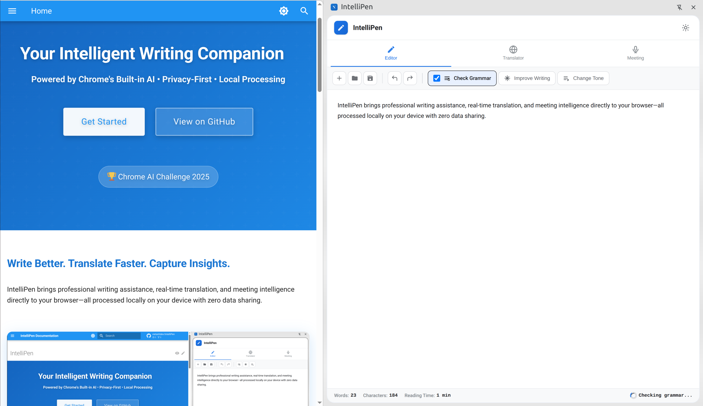
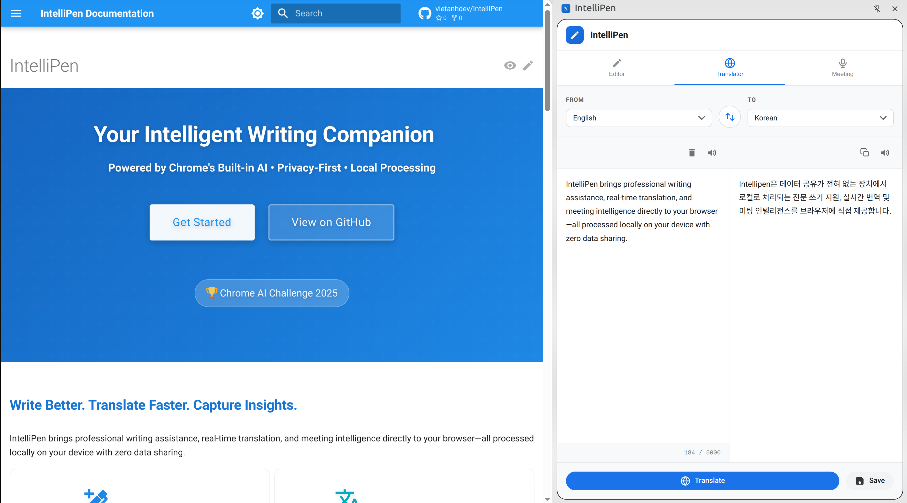
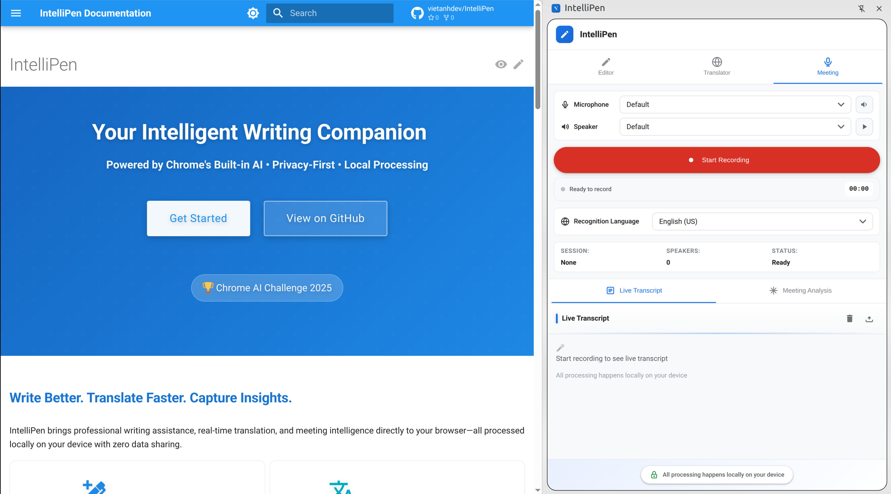

# IntelliPen Chrome Extension

Your intelligent writing companion powered by Chrome's built-in AI. IntelliPen brings professional writing assistance, real-time translation, and meeting intelligence directly to your browser—all processed locally on your device with zero data sharing.

<div align="center">
  
</div>

## Features

### ✍️ IntelliPen Editor
A rich-text editor with comprehensive AI-powered writing assistance:


- **Grammar Checking** (Proofreader API): Real-time grammar, spelling, and punctuation correction
- **Writing Improvement** (Writer API): AI-powered content enhancement for clarity and readability
- **Tone Adjustment** (Rewriter API): Transform text tone (formal, casual, professional, friendly)
- **Document Management**: New, open, save documents with auto-save functionality
- **Real-time Stats**: Word count, character count, and reading time tracking
- **Export Options**: Save as .txt files

### 🌐 Translator
Dedicated translation interface with complete privacy:



- **Multi-language Support**: Translate between 25+ languages, all processed locally
- **Auto-detection** (Language Detector API): Automatic source language identification
- **Real-time Translation**: Instant translation as you type—no data sent to external servers
- **Private Translation**: Unlike cloud-based translators, your sensitive content never leaves your device
- **Text-to-Speech**: Listen to source and translated text
- **Character Counter**: Track text length with visual warnings
- **Language Swap**: Quick swap between source and target languages
- **Context Menu Integration**: Right-click to translate selected text on any webpage
- **Export Options**: Save translations for later use

### 🎙️ Meeting Dashboard
Comprehensive meeting recording and AI-powered analysis:



- **Audio Recording**: Professional recording with microphone permission management
- **Device Selection**: Choose microphone and speaker with test functionality
- **Language Selection**: Support for 15+ recognition languages
- **Live Transcription**: Real-time transcript display using Web Speech API
- **Speaker Identification** (Prompt API): Automatic speaker detection and labeling
- **Executive Summaries** (Summarizer API): AI-generated meeting overviews
- **Action Item Extraction** (Prompt API): Automatic task identification with owner assignment
- **Key Decisions** (Prompt API): Identification of important decisions made
- **Follow-up Email Generation** (Writer API): Professional email drafts with meeting summary
- **Language Detection** (Language Detector API): Automatic meeting language identification
- **Transcript Translation** (Translator API): Translate entire transcripts to other languages
- **Export Options**: Save transcripts and analysis as text files

### 🎨 Modern UI Components
- **Icon System**: Consistent SVG icon library with 20+ icons
- **Reusable Components**: Buttons, badges, cards, toggles, toasts, and context menus
- **Beautiful Branding**: Gradient effects (#667ba2 to #764ba2) on primary UI elements
- **Responsive Design**: Optimized for sidepanel and popup interfaces

### 🔒 Privacy-First Architecture
- **Local Processing**: All AI processing happens locally using Chrome's built-in AI (Gemini Nano)
- **No External Servers**: Your data never leaves your device
- **Encrypted Storage**: Local data is encrypted and stored securely
- **Transparent Privacy**: Clear indicators showing local processing status

## System Requirements

- **Chrome Version**: 138+ (stable)
- **Operating System**: Windows 10+, macOS 13+, Linux, or ChromeOS (Chromebook Plus)
- **Storage**: At least 22 GB free space for Gemini Nano model
- **GPU**: 4+ GB VRAM for AI processing
- **Network**: Unmetered connection for initial model download

### Chrome AI APIs

IntelliPen leverages Chrome's built-in AI APIs:
- ✅ **Prompt API** (LanguageModel) - General AI interactions, action items, decisions
- ✅ **Proofreader API** - Grammar, spelling, and punctuation correction
- ✅ **Writer API** - Content generation and writing improvement
- ✅ **Rewriter API** - Tone adjustment and style transformation
- ✅ **Summarizer API** - Meeting summaries and text summarization
- ✅ **Translator API** - Multi-language translation
- ✅ **Language Detector API** - Automatic language detection

> **Note:** API availability is checked automatically on extension load. The popup shows real-time status for each API.

## Installation

### Development Installation

1. Clone this repository:
   ```bash
   git clone https://github.com/vietanhdev/IntelliPen.git
   cd IntelliPen
   ```

2. Install dependencies:
   ```bash
   npm install
   ```

3. Build the extension:
   ```bash
   npm run build
   ```

4. Load the extension in Chrome:
   - Open Chrome and navigate to `chrome://extensions/`
   - Enable "Developer mode" in the top right
   - Click "Load unpacked" and select the `dist` folder

### Production Installation

IntelliPen will be available on the Chrome Web Store once development is complete.

## Usage

### Opening IntelliPen

1. **Click Extension Icon**: Opens the sidepanel with dual-screen interface
2. **Right-click Menu**: Select text on any webpage and choose "Edit with IntelliPen" or "Translate with IntelliPen"
3. **Popup Menu**: Click the extension icon to see API status and quick actions

### IntelliPen Editor

1. **Start Writing**: Type or paste text into the editor
2. **Grammar Check**: Click the grammar button to check for errors
3. **Improve Writing**: Get AI-powered suggestions for clarity and conciseness
4. **Change Tone**: Select from formal, casual, professional, or friendly tones
5. **Document Management**: Save, open, and auto-save your documents
6. **Real-time Stats**: Monitor word count, character count, and reading time

### Translator

1. **Select Languages**: Choose source (or auto-detect) and target languages
2. **Enter Text**: Type or paste text to translate (up to 5000 characters)
3. **Auto-translate**: Translation happens automatically as you type
4. **Listen**: Click speaker icons to hear text-to-speech
5. **Quick Translate**: Right-click selected text on any webpage for instant translation overlay
6. **Save Settings**: Language preferences are saved automatically

### Meeting Dashboard

1. **Grant Permissions**: Allow microphone access when prompted
2. **Select Devices**: Choose your microphone and speaker from dropdowns
3. **Test Audio**: Use test buttons to verify device functionality
4. **Choose Language**: Select recognition language (15+ languages supported)
5. **Start Recording**: Click the record button to begin
6. **Live Transcript**: View real-time transcription with timestamps
7. **Stop Recording**: Click stop to end recording and trigger AI analysis
8. **Review Analysis**: Get executive summary, action items, key decisions, and follow-up email
9. **Export**: Save transcript and analysis as text files

## Development

### Project Structure

```
intellipen/
├── manifest.json              # Extension manifest (Manifest V3)
├── background.js              # Service worker for extension lifecycle
├── content-scripts/           # Content scripts for web page integration
│   ├── content-script.js
│   └── quick-translate.js
├── popup/                     # Extension popup interface
│   ├── menu.html
│   ├── menu.css
│   ├── menu.js
│   ├── index.html
│   ├── index.css
│   └── index.js
├── sidepanel/                 # Dual-screen interface (Editor + Translator + Meeting)
│   ├── index.html
│   ├── index.css
│   └── index.js
├── src/                       # AI feature modules
│   ├── ai-apis/
│   │   └── AIAPIManager.js    # Central AI API management
│   ├── components/
│   │   └── ui-components.js   # Reusable UI components
│   ├── icons/
│   │   ├── icon-library.js    # SVG icon library
│   │   └── README.md
│   ├── editor/
│   │   └── EditorAIFeatures.js # Editor AI features
│   ├── meeting/
│   │   └── MeetingAIFeatures.js # Meeting AI features
│   └── privacy-manager/
│       ├── PrivacyManager.js
│       └── PrivacyIndicatorUI.js
├── styles/                    # Shared CSS styles
│   ├── components.css         # Component styles
│   ├── icons.css              # Icon styles and animations
│   └── overlay.css            # Overlay styles
├── images/                    # Extension icons
│   ├── icon.svg               # Source SVG icon
│   ├── icon16.png             # 16x16 toolbar icon
│   ├── icon32.png             # 32x32 Windows icon
│   ├── icon48.png             # 48x48 management icon
│   └── icon128.png            # 128x128 store icon
├── scripts/                   # Build and utility scripts
│   └── generate-icons.js      # PNG icon generation
├── docs/                      # Documentation
│   └── icon-showcase.html     # Interactive icon showcase
└── dist/                      # Build output (generated)
```

### Design System

IntelliPen features a comprehensive design system with:

- **Brand Colors**: Gradient from #667ba2 to #764ba2
- **Icon System**: 20+ custom SVG icons with consistent style
- **UI Components**: Buttons, badges, menus, cards, toggles, toasts, and more
- **Animations**: Smooth transitions and loading states

#### Icon Generation

After editing `images/icon.svg`, regenerate PNGs:
```bash
npm run generate-icons
```

View the icon library by opening `docs/icon-showcase.html` in your browser.

### Build Commands

```bash
# Production build
npm run build

# Watch mode for development
npm run build:watch

# Development build
npm run dev

# Clean build directory
npm run clean

# Generate icons from SVG
npm run generate-icons
```

### Chrome AI API Integration

IntelliPen uses Chrome's built-in AI APIs through the AIAPIManager:

```javascript
// Example: Grammar checking with Proofreader API
const result = await aiAPIManager.proofread(text);

// Example: Meeting summarization with Summarizer API
const summary = await aiAPIManager.summarize(transcript, {
  type: 'tldr',
  length: 'medium'
});

// Example: Translation with Translator API
const translated = await aiAPIManager.translate(text, 'en', 'es');

// Example: Streaming responses
await aiAPIManager.writeStreaming(prompt, options, (chunk) => {
  console.log('Received chunk:', chunk);
});
```

## Architecture

### Core Components

- **Service Worker** (`background.js`): Manages extension lifecycle, API coordination, and context menu integration
- **Content Scripts**: Handle Chrome AI API detection and quick translate overlay
- **AI API Manager**: Centralized management for all Chrome built-in AI APIs with availability checking
- **Editor AI Features**: Grammar checking, writing improvement, tone adjustment, and content generation
- **Meeting AI Features**: Meeting analysis, speaker identification, action item extraction, and follow-up email generation
- **UI Components**: Reusable components (buttons, badges, cards, toasts) with consistent styling
- **Icon Library**: SVG-based icon system with 20+ icons and gradient support
- **Privacy Manager**: Handles encryption and local data management

### Key Features

- **Dual-Screen Interface**: Seamless switching between Editor, Translator, and Meeting screens
- **Context Menu Integration**: Right-click to translate or edit selected text on any webpage
- **Real-time API Status**: Popup shows availability status for all Chrome AI APIs
- **Streaming Support**: Progressive rendering for long AI responses
- **Fallback Mechanisms**: Graceful degradation when APIs are unavailable
- **Auto-save**: Automatic content saving in editor
- **Device Management**: Microphone and speaker selection with testing

## Privacy

IntelliPen is built with privacy as a core principle:

- **Local Processing**: All AI operations happen on your device using Chrome's built-in APIs
- **No Data Collection**: We don't collect, store, or transmit your personal data
- **Encrypted Storage**: Any local data is encrypted with industry-standard encryption
- **Transparent Operations**: Clear indicators show when and how your data is processed

## Current Status

### ✅ Implemented Features

- ✅ Chrome extension foundation (Manifest V3)
- ✅ Dual-screen interface (Editor + Translator + Meeting Dashboard)
- ✅ Complete Chrome AI API integration (7 APIs)
- ✅ AI API Manager with availability checking
- ✅ Editor with grammar checking, writing improvement, and tone adjustment
- ✅ Dedicated translator with 25+ languages and auto-detection
- ✅ Meeting recording with device selection and language support
- ✅ Meeting analysis (summaries, action items, decisions, follow-up emails)
- ✅ Context menu integration for quick translate and edit
- ✅ Icon system with 20+ SVG icons and gradient support
- ✅ Reusable UI components library
- ✅ Document management with auto-save
- ✅ Real-time stats (word count, character count, reading time)
- ✅ Export functionality for documents, translations, and transcripts
- ✅ Privacy-first architecture with local processing
- ✅ Streaming support for progressive AI responses
- ✅ Fallback mechanisms for unavailable APIs

### 🚧 Future Enhancements

- Universal text field detection for inline writing assistance
- Real-time grammar overlay on web pages
- Platform-specific adapters (Gmail, LinkedIn, Notion, Google Docs)
- Advanced speaker diarization
- Meeting templates and presets
- Collaborative editing features
- Cloud sync (optional, privacy-preserving)
- Advanced analytics dashboard

## Support

- **Issues**: [GitHub Issues](https://github.com/vietanhdev/IntelliPen/issues)
- **Discussions**: [GitHub Discussions](https://github.com/vietanhdev/IntelliPen/discussions)

## Acknowledgments

- Chrome team for the built-in AI APIs
- Open source community for tools and libraries
- Beta testers and early adopters for feedback

---

**IntelliPen** - Intelligent writing and meeting companion, powered by local AI processing.
