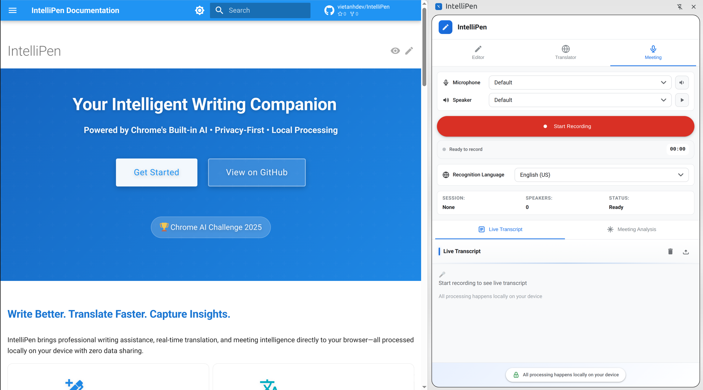

# Meeting Dashboard Features

Record, transcribe, and analyze meetings with AI.

## Audio Recording

Professional recording with microphone permission management.

## Device Selection

Choose microphone and speaker with test functionality.

## Language Selection

Support for 15+ recognition languages.

## Live Transcription

Real-time transcript display using Web Speech API.

## AI Analysis

- Executive summaries
- Action items
- Key decisions
- Follow-up emails

## Export Options

Save transcripts and analysis as text files.

For detailed usage instructions, see the [User Guide](../user-guide.md#meeting-dashboard).
