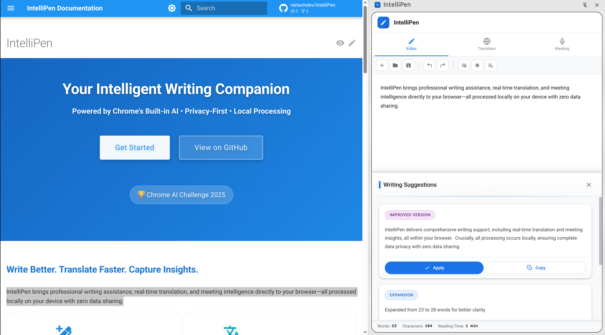
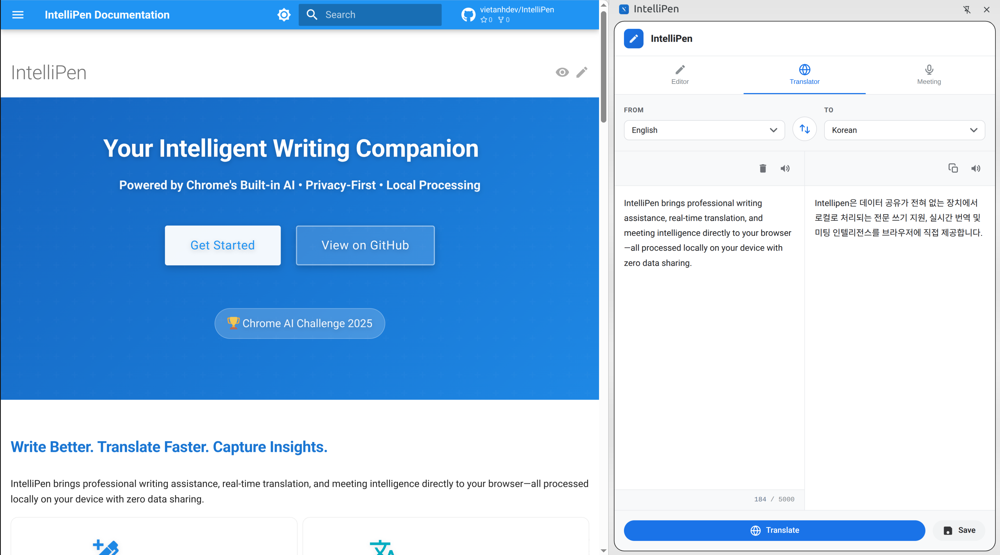

# User Guide

Complete guide to using all IntelliPen features.

## IntelliPen Editor

The IntelliPen Editor provides comprehensive AI-powered writing assistance.

### Basic Editing

#### Creating Documents

- Click "New Document" to start fresh
- Type or paste text into the editor
- Auto-save keeps your work safe

#### Document Management

- **Save Document**: Save current content as .txt file
- **Open Document**: Load previously saved documents
- **Auto-save**: Content is automatically saved every 30 seconds

#### Real-time Statistics

- Word count
- Character count
- Estimated reading time

### Grammar Checking

Powered by Chrome's Proofreader API:

1. Type or paste text into the editor
2. Click "Check Grammar" button
3. Review detected issues:
    - Spelling errors
    - Grammar mistakes
    - Punctuation problems
4. Each issue includes:
    - Error description
    - Suggested correction
    - Explanation of the rule
5. Click suggestions to apply corrections

!!! tip "Grammar Check Tips"
    - Grammar check works best with complete sentences
    - Review suggestions carefully - AI isn't always perfect
    - Use for emails, documents, and professional writing

### Writing Improvement

Powered by Chrome's Writer API:

1. Select text you want to improve (or check entire document)
2. Click "Improve Writing"
3. AI analyzes and suggests improvements for:
    - Clarity and conciseness
    - Readability
    - Professional tone
    - Sentence structure
4. Review suggestions and apply selectively

!!! example "Use Cases"
    - Simplifying complex sentences
    - Making technical writing more accessible
    - Improving email clarity
    - Enhancing professional documents

### Tone Adjustment

Powered by Chrome's Rewriter API:

1. Select text to adjust
2. Click "Change Tone"
3. Choose from tone options:
    - **More Formal**: Professional, business-appropriate
    - **More Casual**: Friendly, conversational
    - **As-Is**: Maintain current tone with minor improvements
4. Preview the rewritten text
5. Apply or try different tones

!!! example "Examples"
    - **Formal**: "I would appreciate your assistance with this matter"
    - **Casual**: "Could you help me out with this?"

## Translator

Dedicated translation interface with privacy-first design.

### Basic Translation

=== "Select Languages"

    - **Source language**: Choose language or use "Auto-detect"
    - **Target language**: Select from 25+ supported languages

=== "Enter Text"

    - Type or paste text (up to 5000 characters)
    - Translation happens automatically as you type
    - Character counter shows remaining space

=== "View Translation"

    - Translated text appears in real-time
    - Formatting is preserved
    - Copy translated text with one click

### Supported Languages

IntelliPen supports translation between these languages:

- English
- Spanish
- French
- German
- Italian
- Portuguese
- Russian
- Chinese (Simplified)
- Chinese (Traditional)
- Japanese
- Korean
- Arabic
- Hindi
- Dutch
- Polish
- Turkish
- Swedish
- And 10+ more languages

### Auto-Detection

Let AI identify the source language:

1. Select "Auto-detect" as source language
2. Type or paste text
3. AI automatically detects the language
4. Translation proceeds automatically

!!! tip "Best for"
    - Multilingual content
    - Unknown language identification
    - Quick translations without language selection

### Text-to-Speech

Listen to source and translated text:

1. Click speaker icon next to source text
2. Click speaker icon next to translated text
3. Adjust volume and speed in browser settings
4. Use for pronunciation practice

## Meeting Dashboard

Record, transcribe, and analyze meetings with AI.

### Setting Up

#### 1. Grant Permissions

- Allow microphone access when prompted
- Required for recording functionality

#### 2. Select Devices

- Choose microphone from dropdown
- Select speaker for playback
- Use test buttons to verify

#### 3. Choose Language

- Select recognition language (15+ supported)
- Must match the language spoken in meeting
- Affects transcription accuracy

### Recording a Meeting

=== "Start Recording"

    - Click "Start Recording" button
    - Red indicator shows recording is active
    - Timer displays recording duration

=== "Live Transcription"

    - Transcript appears in real-time
    - Timestamps show when each segment was spoken
    - Scroll to review earlier parts

=== "Stop Recording"

    - Click "Stop Recording" when meeting ends
    - AI analysis begins automatically
    - Wait for analysis to complete (30-60 seconds)

### Meeting Analysis

After recording stops, AI generates:

#### Executive Summary

- High-level overview of meeting
- Key topics discussed
- Main outcomes and conclusions
- Generated using Summarizer API

#### Action Items

- Specific tasks identified
- Assigned owners (when mentioned)
- Deadlines and priorities
- Extracted using Prompt API

#### Key Decisions

- Important decisions made
- Rationale and context
- Stakeholders involved
- Identified using Prompt API

#### Follow-up Email

- Professional email draft
- Meeting summary
- Action items listed
- Ready to send or customize
- Generated using Writer API

## Context Menu Integration

Access IntelliPen features from any webpage.

### Edit with IntelliPen

1. Select text on any webpage
2. Right-click and choose "Edit with IntelliPen"
3. Sidepanel opens with text in editor
4. Use all editor features (grammar, improve, tone)
5. Copy improved text back to webpage

!!! example "Use Cases"
    - Improving email drafts in Gmail
    - Editing social media posts
    - Refining document text
    - Checking grammar in forms

### Translate with IntelliPen

1. Select text on any webpage
2. Right-click and choose "Translate with IntelliPen"
3. Translation overlay appears instantly
4. View translation without leaving page
5. Click outside to dismiss

!!! example "Use Cases"
    - Reading foreign language websites
    - Translating social media posts
    - Understanding product descriptions
    - Learning new languages

## Tips and Best Practices

### Writing Tips

!!! tip "Best Practices"
    - **Be Specific**: Provide context for better AI suggestions
    - **Review Carefully**: AI suggestions aren't always perfect
    - **Iterate**: Use multiple AI features in sequence
    - **Save Often**: Use auto-save and manual saves
    - **Experiment**: Try different tones and styles

### Translation Tips

!!! tip "Best Practices"
    - **Context Matters**: Provide full sentences for accuracy
    - **Verify Important**: Back-translate critical content
    - **Use Auto-detect**: When unsure of source language
    - **Check Idioms**: Idioms may not translate literally
    - **Privacy First**: Your text never leaves your device

### Meeting Tips

!!! tip "Best Practices"
    - **Test First**: Always test audio before important meetings
    - **Good Microphone**: Quality input improves transcription
    - **Clear Speech**: Speak clearly and avoid overlapping
    - **Review Transcript**: Check for accuracy after recording
    - **Edit Analysis**: Refine AI-generated action items
